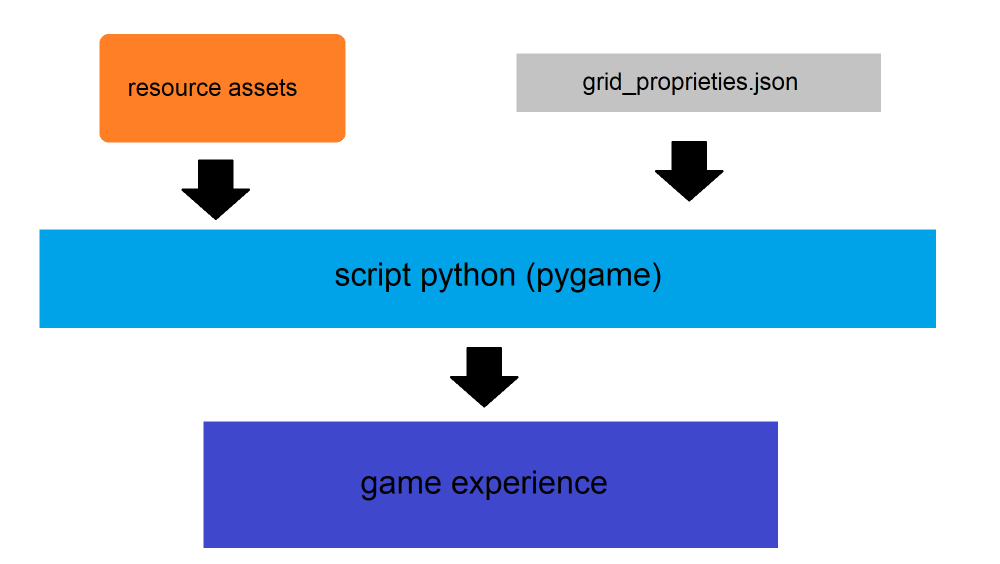

# Wargame

This **Wargame** is a turn-based strategy video game inspired by classic tabletop wargames like *Bolt Action*, developed in Python with Pygame. The game simulates battles between squads of units on a grid map, with simple but effective rules and very low computer resource usage.

## Main Features

- **Turn-based gameplay**: Each player controls a squad of units and performs actions such as movement, attack, ambush, heal, etc.
- **A lot of units**: Infantry, tanks, machine guns, mortars, howitzers, armored vehicles, each with unique stats and abilities.
- **Point system**: Each unit has a point cost to balance the squads.
- **Multi-shot attacks**: Some weapons fire multiple shots per turn, each with its own hit probability.
- **Visual and sound effects**: Explosion animations, missed shots, health bar, ambient and attack sounds.
- **Supervised AI (MLP Neural Network)**: The game can record matches and train a bot using a Multilayer Perceptron (MLP, via scikit-learn) and use it as an opponent.
- **Customization**: Easily add new units, change scenarios, rules, and maps via JSON files.

## Requirements

- Python 3.8+
- [pygame](https://www.pygame.org/)
- [scikit-learn](https://scikit-learn.org/) (only for the AI part)
- [matplotlib](https://matplotlib.org/) (only for the AI part)
- All dependencies can be installed via pip:

```sh
pip install pygame scikit-learn matplotlib
```

## Project Structure

The following image shows the function of the different contents:

<p align="center">
  
</p>

Sorry for having written the code in Italian; it will be translated into English in the future.

## Starting the Game

1. Clone the repository and navigate to the project folder.
2. Check the rulebook.
3. Make sure you have the resource files (`assets/`), configuration files (`grid_properties.json`, etc.).
4. Build your army respecting the 1000-point limit per squad (if you don't want to use the default one).
5. Start the game with:

```sh
python prova.py
```

## Gameplay

- **Select a unit** by clicking on it.
- Choose the action using the buttons that appear around the unit (Fire, Forward, Run, Ambush, Heal, Down).
- Move units and attack enemies following the movement rules, line of sight, and weapon-target compatibility.
- The team that eliminates all enemy units and reaches 1000 points wins.

## AI and Match Recording

- The game can record each turn in a JSON file to train a supervised bot.
- The bot uses a Multilayer Perceptron (MLP) neural network to learn strategies from the collected data.
- For details on how to train and use the bot, see the separate `readme.md` and the `Hierarchical Policy.py` file.

## Customization

- **Units and squads**: Editable via JSON files in the `assets/` folder.
- **Rules**: You can change unit parameters directly in the code.
- **Animations, images, and sounds**: Replace or add sprites and audio files in the `assets/` folder.
  For more details, see the `custom.md` file.

## Rulebook

For detailed game rules, see the `manuale.md` file.

## License

This project is distributed under the GPL-2 license.  
Images and sounds are for demonstration purposes only.

## Resources

Some resources are temporary and will be improved in the future.

## Questions, bugs, or ideas?

For anything, open an issue in this repository ;)
